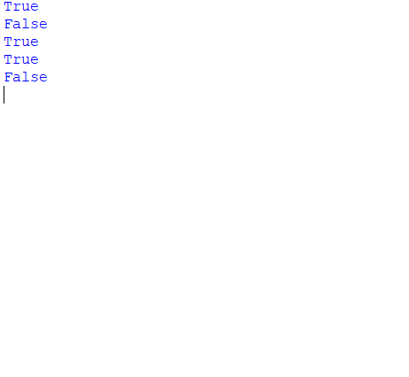

192110648

TEST :

exam_q1.py - leap year

exam_q2.py - prime number or not

exam_q3.py - get 3 marks find avg,total and assign grade

exam_2_q1.py - sumsquare

exam_3_q1.py - max no of words in ascentence

exam_5_q1.py - how many nums are smaller than current number

DAY - 1 :

program_1.py - isomorphic

program_2.py - sum of square of even and odd numbers

program_3.py - happy number or not

program_4.py - palindrome or not

program_5.py - bakery problem

program_6.py - max area of water

program_7.py - strings with only vowels sorted lexicographically

program_8.py - valid number

program_9.py - party organization

program_10.py - letters replaced by moving n steps forward where n is the repetition

DAY - 2 :

program_11.py - climbing staircase

program_12.py - check if its leap year if not find previos leap year 

program_13.py - max words found in a sentence

program_14.py - merge two sorted list

program_15.py - basic calculator

program_16.py - dialer 

program_17.py - generate all possible well formed paranthesis for given no. of paranthesis

program_18.py - regular expression matching

program_19.py - find season based on month and day

program_20.py - to find uncommon words and print them

DAY - 3 :

program_21.py - stock market

program_22.py - team assembly possible combination

program_23.py - numbers smaller than the current number 

program_24.py - sum of two binary strings

program_25.py - max no of steps that can be made forward

program_26.py - mirror view of given value

program_27.py - possible unique permutations

program_28.py - anagrams

program_29.py - regular expression matching

program_30.py - min no of operations required to change one word to another

DAY - 4 :

program_31.py - fizzbuzz questoion

program_32.py - get no of student user detail from client server

program_33.py - how many nums are smaller than current number

program_34.py - valid palindrome or not

program_35.py - max no of steps

program_36.py - delete all occurance of c in s and print output

program_37.py - loxilogically sorted

program_38.py - roman number to integer

program_39.py - find season with day and month

program_40.py - check if string 1  and string 2 is just scrambled words

DAY - 5 :

program_41.py - the no of letters in the last word of the scentence

program_42.py - salary,bonus and total salary 

program_43.py - find the least number of sum of squares that is equal to n

program_44.py - 

program_45.py - 

program_46.py - 

program_47.py - 

program_48.py - 

program_49.py - 

program_50.py - 
